Untitled
================
XINLU ZHOU
10/25/2018

K-means clustering
------------------

Our first example with **kmeans()** function.

``` r
# example plot to see how Rmarkdown works
plot(1:10, typ="l")
```


Back to kmeans...

``` r
# Generate some example data for clustering
tmp <- c(rnorm(30,-3), rnorm(30,3))
x <- cbind(x=tmp, y=rev(tmp))

plot(x)
```

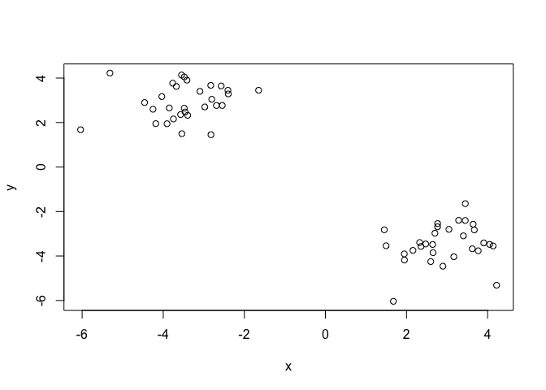

Use the kmeans() function setting k to 2 and nstart=20 Inspect/print the results

``` r
k <- kmeans(x, centers = 2, nstart = 20)
```

Q. How many points are in each cluster?

``` r
k$size
```

    ## [1] 30 30

Q. What ‘component’ of your result object details - cluster size? `K$size` - cluster assignment/membership? - cluster center?

``` r
k$cluster
```

    ##  [1] 2 2 2 2 2 2 2 2 2 2 2 2 2 2 2 2 2 2 2 2 2 2 2 2 2 2 2 2 2 2 1 1 1 1 1
    ## [36] 1 1 1 1 1 1 1 1 1 1 1 1 1 1 1 1 1 1 1 1 1 1 1 1 1

``` r
table(k$cluster)
```

    ## 
    ##  1  2 
    ## 30 30

``` r
k$centers
```

    ##           x         y
    ## 1  2.922838 -3.463295
    ## 2 -3.463295  2.922838

Plot x colored by the kmeans cluster assignment and add cluster centers as blue points

``` r
palette(c("blue", "red"))
plot(x, col=k$cluster)
points(k$centers, col = "blue", pch=20, cex=3)
```

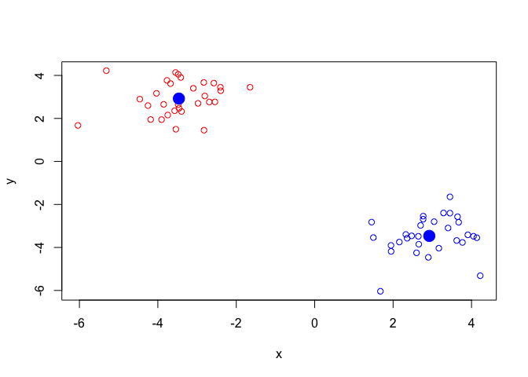 Q. Repeat for k=3, which has the lower tot.withinss?

``` r
k2 <- kmeans(x, centers = 2, nstart = 20)
k3 <- kmeans(x, centers = 3, nstart = 20)
k4 <- kmeans(x, centers = 4, nstart = 20)
k5 <- kmeans(x, centers = 5, nstart = 20)

k2$tot.withiness
```

    ## NULL

``` r
k3$tot.withinss
```

    ## [1] 64.41288

``` r
k4$tot.withinss
```

    ## [1] 47.47942

``` r
k5$tot.withinss
```

    ## [1] 39.6181

``` r
plot(c(k2$tot.withinss,k3$tot.withinss,k4$tot.withinss,k5$tot.withinss),typ= "b")
```

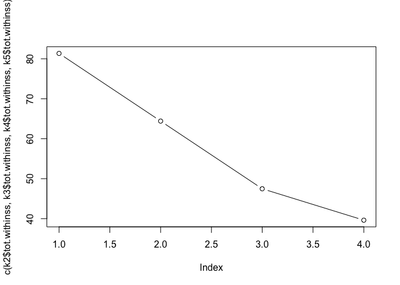

Hierarchical clustering
=======================

``` r
d <- dist(x)
hc<- hclust(d)
plot(hc)
```

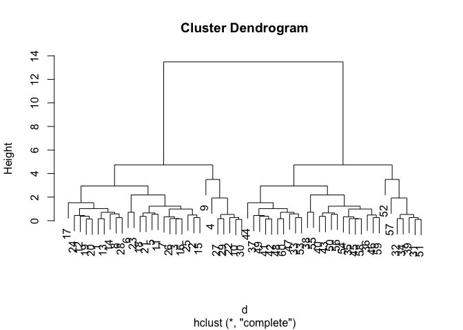

``` r
plot(hc)
abline(h=8,col="red")
```

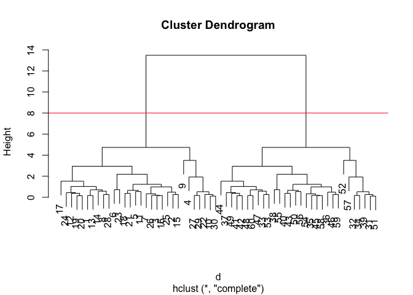

``` r
#cut the tre to yield cluster membership vector
cutree(hc, h=8)
```

    ##  [1] 1 1 1 1 1 1 1 1 1 1 1 1 1 1 1 1 1 1 1 1 1 1 1 1 1 1 1 1 1 1 2 2 2 2 2
    ## [36] 2 2 2 2 2 2 2 2 2 2 2 2 2 2 2 2 2 2 2 2 2 2 2 2 2

``` r
cutree(hc, k=2)
```

    ##  [1] 1 1 1 1 1 1 1 1 1 1 1 1 1 1 1 1 1 1 1 1 1 1 1 1 1 1 1 1 1 1 2 2 2 2 2
    ## [36] 2 2 2 2 2 2 2 2 2 2 2 2 2 2 2 2 2 2 2 2 2 2 2 2 2

``` r
# Step 1. Generate some example data for clustering
x <- rbind(
  matrix(rnorm(100, mean=0, sd = 0.3), ncol = 2),   # c1
  matrix(rnorm(100, mean = 1, sd = 0.3), ncol = 2), # c2
  matrix(c(rnorm(50, mean = 1, sd = 0.3),           # c3
           rnorm(50, mean = 0, sd = 0.3)), ncol = 2))
colnames(x) <- c("x", "y")
# Step 2. Plot the data without clustering
plot(x)
```

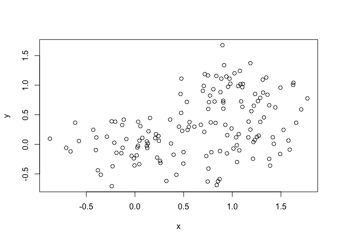

``` r
# Step 3. Generate colors for known clusters
#         (just so we can compare to hclust results)
col <- as.factor( rep(c("c1","c2","c3"), each=50) )
palette(c("red","blue","black"))
plot(x, col=col,pch=20)
```

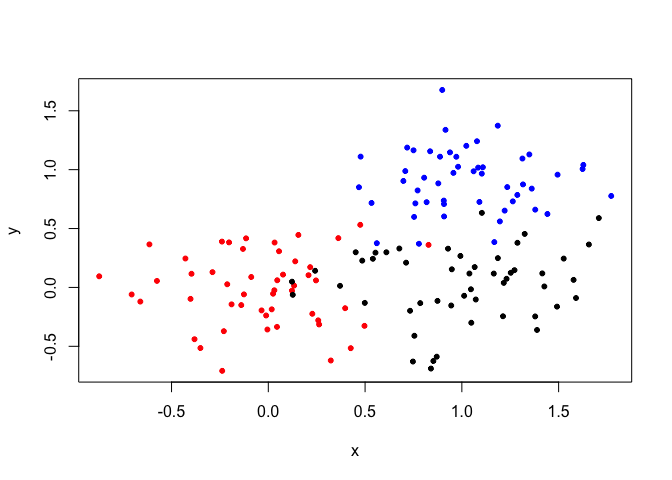 \# Q. Use the dist(), hclust(), plot() and cutree() functions to return 2 and 3 clusters

``` r
d <- dist(x)
hc<- hclust(d)
plot(hc)
```

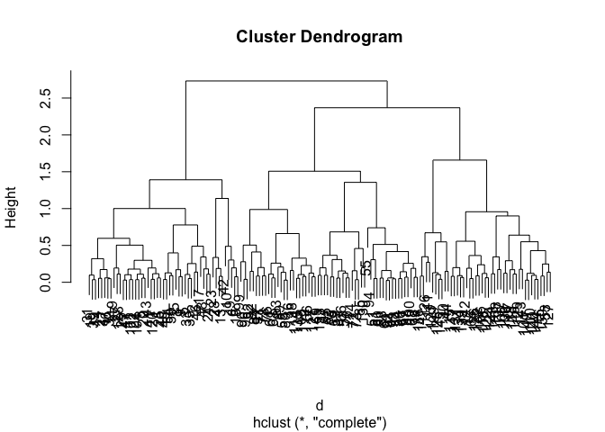 \# use cutree function to return 2 and 3 clusters

``` r
grp.2 <- cutree(hc, k=2)
grp.3 <- cutree(hc, k=3)
```

Q. How does this compare to your known 'col' groups?
====================================================

``` r
table(grp.3,col)
```

    ##      col
    ## grp.3 c1 c2 c3
    ##     1 44  0  5
    ##     2  4  2 37
    ##     3  2 48  8

principal component analysis
============================

Let's make up some data data
============================

``` r
## Initialize a blank 100 row by 10 column matrix
mydata <- matrix(nrow=100, ncol=10)
## Lets label the rows gene1, gene2 etc. to gene100
rownames(mydata) <- paste("gene", 1:100, sep="")
## Lets label the first 5 columns wt1, wt2, wt3, wt4 and wt5
##   and the last 5 ko1, ko2 etc. to ko5 (for "knock-out")
colnames(mydata) <- c( paste("wt", 1:5, sep=""),
                       paste("ko", 1:5, sep="") )
## Fill in some fake read counts
for(i in 1:nrow(mydata)) {
wt.values <- rpois(5, lambda=sample(x=10:1000, size=1)) 
ko.values <- rpois(5, lambda=sample(x=10:1000, size=1))
mydata[i,] <- c(wt.values, ko.values)
}
head(mydata)
```

    ##       wt1 wt2 wt3 wt4 wt5 ko1 ko2 ko3 ko4  ko5
    ## gene1  51  37  49  54  53 932 914 846 887  881
    ## gene2 762 755 749 783 735 531 560 552 544  540
    ## gene3 227 229 221 257 241 943 973 964 997 1007
    ## gene4 934 883 895 995 978 693 695 684 638  704
    ## gene5 706 626 639 670 640 450 477 490 476  455
    ## gene6 776 784 757 727 742 345 345 352 347  339

``` r
head(t(mydata))
```

    ##     gene1 gene2 gene3 gene4 gene5 gene6 gene7 gene8 gene9 gene10 gene11
    ## wt1    51   762   227   934   706   776   818   376   534    100    590
    ## wt2    37   755   229   883   626   784   786   336   510     88    587
    ## wt3    49   749   221   895   639   757   788   359   513     74    557
    ## wt4    54   783   257   995   670   727   857   369   508     71    601
    ## wt5    53   735   241   978   640   742   779   378   521    100    563
    ## ko1   932   531   943   693   450   345   460   481   254    135    176
    ##     gene12 gene13 gene14 gene15 gene16 gene17 gene18 gene19 gene20 gene21
    ## wt1    961    425    131    308    724     73    589    477    440    532
    ## wt2    947    433    127    278    743     80    619    443    487    522
    ## wt3    961    411    124    301    721     74    602    467    461    583
    ## wt4    950    422    114    259    699     89    559    459    470    579
    ## wt5    924    436    128    301    710    102    578    455    468    573
    ## ko1    917    803    562    551    591    504    623    685    622    135
    ##     gene22 gene23 gene24 gene25 gene26 gene27 gene28 gene29 gene30 gene31
    ## wt1    926    724    404    669    527    340    326    205    878     76
    ## wt2    903    711    362    605    555    348    367    223    838     75
    ## wt3    990    762    373    650    541    319    353    224    851     57
    ## wt4    894    708    383    619    582    349    353    195    859     73
    ## wt5    958    671    364    654    541    377    328    204    796     71
    ## ko1    694    880    913    370    186     51     19    700    611    287
    ##     gene32 gene33 gene34 gene35 gene36 gene37 gene38 gene39 gene40 gene41
    ## wt1    243    660    366    157    420    324    264    535    770     60
    ## wt2    286    688    386    134    383    330    269    608    793     61
    ## wt3    289    646    384    167    400    314    285    600    769     53
    ## wt4    288    672    388    134    404    307    249    584    748     44
    ## wt5    266    686    395    135    381    338    253    577    761     55
    ## ko1    251    139    759    877    641    319    305    519     58    191
    ##     gene42 gene43 gene44 gene45 gene46 gene47 gene48 gene49 gene50 gene51
    ## wt1    915    320    656    817     56    790     46    761    502    752
    ## wt2    923    318    694    799     45    827     51    841    499    832
    ## wt3    977    321    684    795     51    789     49    812    514    786
    ## wt4    901    314    721    801     42    753     60    808    517    834
    ## wt5    986    341    693    780     48    766     34    784    499    775
    ## ko1    746    423     69    911    548    627    338    586    673    651
    ##     gene52 gene53 gene54 gene55 gene56 gene57 gene58 gene59 gene60 gene61
    ## wt1    137    688    368    818    962    496     51    658    766    807
    ## wt2    133    612    372    845    886    529     56    637    739    728
    ## wt3    158    686    418    842    862    532     43    641    700    809
    ## wt4    149    669    420    845    943    542     57    642    655    772
    ## wt5    159    635    382    844    962    525     50    581    688    779
    ## ko1    176    666    581    192    427     89    166    830    945    122
    ##     gene62 gene63 gene64 gene65 gene66 gene67 gene68 gene69 gene70 gene71
    ## wt1    166    500    428    219    673    109    502     94    459    760
    ## wt2    160    484    447    198    693    114    534     86    401    796
    ## wt3    140    515    432    222    621     98    494     79    417    789
    ## wt4    161    484    435    211    596    111    584     82    379    826
    ## wt5    157    471    443    234    681    112    553     88    407    800
    ## ko1    598    291    214    961    756    747    696    240    587    188
    ##     gene72 gene73 gene74 gene75 gene76 gene77 gene78 gene79 gene80 gene81
    ## wt1    362    593    801    359    492    271    525    903    189    399
    ## wt2    401    600    841    401    483    241    562    916    183    410
    ## wt3    348    652    813    411    474    264    516    829    160    408
    ## wt4    367    657    839    336    484    224    573    860    179    405
    ## wt5    371    642    864    370    456    253    559    848    176    403
    ## ko1    490    334    603    912    387    476    788    801    520    310
    ##     gene82 gene83 gene84 gene85 gene86 gene87 gene88 gene89 gene90 gene91
    ## wt1    670   1007    276    460    798    623     16    685     13     61
    ## wt2    649   1037    273    503    845    584     17    692      6     69
    ## wt3    644    969    279    461    860    618     19    695      9     72
    ## wt4    636    939    253    432    863    576     13    656     11     78
    ## wt5    642   1015    261    461    854    623     18    696      5     72
    ## ko1    714    380    374    594    582    394     79    360    163    784
    ##     gene92 gene93 gene94 gene95 gene96 gene97 gene98 gene99 gene100
    ## wt1    125    278   1021    453    888   1026    821    555     381
    ## wt2    143    275   1033    456    857    966    826    583     343
    ## wt3    124    233   1011    460    885    976    913    558     336
    ## wt4    130    281   1006    438    860    997    835    537     333
    ## wt5    126    279   1009    470    891   1001    874    540     360
    ## ko1    625    202    561    314    379    208    452    510     815

``` r
pca <- prcomp(t(mydata), scale=TRUE)
pca
```

    ## Standard deviations (1, .., p=10):
    ##  [1] 9.500239e+00 1.560872e+00 1.468650e+00 1.159640e+00 1.053250e+00
    ##  [6] 9.432071e-01 8.894920e-01 7.565393e-01 6.670274e-01 3.005496e-15
    ## 
    ## Rotation (n x k) = (100 x 10):
    ##                 PC1           PC2           PC3           PC4
    ## gene1    0.10519276  3.049171e-03 -0.0016204630  0.0117869388
    ## gene2   -0.10450475  1.993724e-02 -0.0195163920 -0.0127678120
    ## gene3    0.10497197  2.500092e-02 -0.0296942543  0.0074970625
    ## gene4   -0.10142634  2.781500e-02 -0.0453135947 -0.1083396252
    ## gene5   -0.10199536  5.956276e-02  0.0383927517 -0.1193385225
    ## gene6   -0.10486954 -2.292168e-02  0.0406321043  0.0064115832
    ## gene7   -0.10415027  4.936826e-03  0.0291352885 -0.0357230739
    ## gene8    0.09953945 -5.615889e-02 -0.0825192665 -0.1466316611
    ## gene9   -0.10417295 -1.384179e-03 -0.0033498463 -0.0819151601
    ## gene10   0.09980721 -2.129390e-02  0.0598552603 -0.1697886078
    ## gene11  -0.10501759 -6.866150e-03  0.0071290146 -0.0201753252
    ## gene12  -0.05623498  3.379862e-01  0.2752679522  0.4322082534
    ## gene13   0.10474602 -2.717898e-02  0.0007368001  0.0092561541
    ## gene14   0.10515051  1.289028e-03 -0.0110133008  0.0009673444
    ## gene15   0.10431562 -2.821628e-02  0.0545766807 -0.0433739205
    ## gene16  -0.10257852 -7.922920e-02 -0.0066098275  0.0398568864
    ## gene17   0.10478766  8.233362e-03 -0.0031991182 -0.0035598678
    ## gene18   0.01087065 -5.071285e-01  0.3114717189  0.2614963549
    ## gene19   0.10406522  2.553599e-02 -0.0198099742 -0.0320258937
    ## gene20   0.10350423 -2.654416e-03 -0.0645397453  0.0806724205
    ## gene21  -0.10483955  2.154268e-02 -0.0139195575 -0.0020524186
    ## gene22  -0.10211635 -6.938933e-02  0.0259486777 -0.0046214112
    ## gene23   0.10078737 -3.459118e-02 -0.0037827012  0.0486069045
    ## gene24   0.10492133  3.088698e-02 -0.0109917957  0.0268733124
    ## gene25  -0.10374827  2.766873e-02  0.0796650568 -0.0045140622
    ## gene26  -0.10501646  2.004549e-03 -0.0265622722 -0.0136243594
    ## gene27  -0.10477689 -8.902113e-03  0.0081376900 -0.0489830344
    ## gene28  -0.10502731 -2.060617e-02  0.0008789594  0.0383197495
    ## gene29   0.10479731 -1.016290e-02  0.0015894128  0.0005561817
    ## gene30  -0.10251983  8.732089e-03 -0.0136888635  0.0344295593
    ## gene31   0.10448308 -3.549592e-02  0.0355661460 -0.0229177916
    ## gene32  -0.03372605 -3.665055e-02 -0.5089450374  0.4611843662
    ## gene33  -0.10517897 -7.412725e-03  0.0065307224 -0.0108598927
    ## gene34   0.10457650 -3.633918e-02 -0.0543654363 -0.0428517833
    ## gene35   0.10490180 -1.889424e-02 -0.0401965265 -0.0077512819
    ## gene36   0.10439235  8.893064e-05  0.0311767876 -0.0387829522
    ## gene37  -0.07409346 -1.152883e-01  0.3395506896 -0.0802706356
    ## gene38   0.09236166  2.722926e-02  0.0340703987  0.2699072607
    ## gene39  -0.07158717 -2.540586e-01 -0.3924695444  0.1164132098
    ## gene40  -0.10517369 -8.890425e-03  0.0131322257  0.0026848729
    ## gene41   0.10483052  1.028284e-02  0.0157189782  0.0370164118
    ## gene42  -0.09189154  1.336480e-01 -0.0587219795  0.0115935044
    ## gene43   0.10028755  2.667943e-02 -0.0348192425  0.0367282501
    ## gene44  -0.10511129 -3.322151e-03  0.0004418429  0.0095526209
    ## gene45   0.08745126  1.317821e-01  0.2682161917  0.1736883892
    ## gene46   0.10483749 -2.299745e-02  0.0036078350 -0.0103971523
    ## gene47  -0.10190308 -9.852057e-02  0.0218973273  0.0828412037
    ## gene48   0.10471902 -1.168564e-02 -0.0097527469 -0.0034695622
    ## gene49  -0.10242505 -1.744935e-02 -0.0680942660  0.1571428383
    ## gene50   0.10363818 -2.820566e-02 -0.0677632943 -0.0064257704
    ## gene51  -0.09983815  9.102994e-03  0.0121729517  0.1628378531
    ## gene52   0.09061387  1.770683e-01 -0.0655802674  0.0419525575
    ## gene53   0.06018183  4.494360e-01  0.0404852396  0.1314272499
    ## gene54   0.10222095  6.327259e-02 -0.1101151764 -0.0109831218
    ## gene55  -0.10521387 -1.379338e-02  0.0013031083 -0.0032105456
    ## gene56  -0.10418254  3.049925e-03  0.0230455662 -0.0879073437
    ## gene57  -0.10517879 -2.511480e-03 -0.0073304327  0.0097409093
    ## gene58   0.10461085 -2.955920e-02  0.0104389130 -0.0029550815
    ## gene59   0.09944940  4.335782e-02  0.1299648073  0.1422136262
    ## gene60   0.09968254 -1.317231e-01  0.1365508207 -0.0104905820
    ## gene61  -0.10490034  1.366657e-02  0.0220808607 -0.0137095339
    ## gene62   0.10483181  2.415239e-03 -0.0058725575 -0.0340540305
    ## gene63  -0.10443421  9.112034e-03  0.0139611100  0.0438228432
    ## gene64  -0.10485569 -2.172834e-02 -0.0055759992 -0.0083378566
    ## gene65   0.10509595 -1.792636e-02  0.0019188750 -0.0150698508
    ## gene66   0.09410150  1.940111e-02  0.1199029536 -0.0606905683
    ## gene67   0.10511733  1.809081e-02 -0.0023058551  0.0113492207
    ## gene68   0.10029519  2.708764e-02 -0.1342265670 -0.0330003305
    ## gene69   0.10461394 -3.491038e-02 -0.0080037849 -0.0377568025
    ## gene70   0.10158238 -1.724573e-02  0.1447876771  0.0016736346
    ## gene71  -0.10513847 -7.921803e-03 -0.0016848975 -0.0060700088
    ## gene72   0.10130844 -1.206388e-01 -0.0619001119 -0.0625617258
    ## gene73  -0.10438081  2.226122e-02 -0.0334257061 -0.0140538010
    ## gene74  -0.10406279 -4.801357e-05 -0.0454523371 -0.0113983414
    ## gene75   0.10482780 -8.508252e-03 -0.0107511045  0.0372498272
    ## gene76  -0.09911216  2.475110e-02 -0.0065744916 -0.0674258165
    ## gene77   0.10382205  3.450637e-02  0.0665431307  0.0697612187
    ## gene78   0.10338565  5.923999e-02 -0.0269363437  0.0152427858
    ## gene79  -0.08211991 -8.885245e-02  0.1288665325  0.1763819581
    ## gene80   0.10504668 -3.294745e-03  0.0046816888 -0.0302110157
    ## gene81  -0.09764204  1.207236e-01  0.0203514736  0.0908271242
    ## gene82   0.07187050  1.048362e-02  0.0241131021  0.2684186776
    ## gene83  -0.10480085 -2.201851e-02  0.0315162253 -0.0243034259
    ## gene84   0.09814272 -1.687743e-01  0.0582881919  0.0736906020
    ## gene85   0.09937745 -1.118073e-01  0.0143923787 -0.0270667519
    ## gene86  -0.10384803 -2.249469e-02 -0.0872589896  0.0059932462
    ## gene87  -0.10222315  4.116450e-02  0.0409690344 -0.0568967243
    ## gene88   0.10435162  5.199072e-03  0.0395372557  0.0043228725
    ## gene89  -0.10446773  2.467557e-02  0.0236919910 -0.0025373575
    ## gene90   0.10495753  8.741002e-03 -0.0375782534  0.0012956802
    ## gene91   0.10502933 -4.092995e-03 -0.0062757230 -0.0113239416
    ## gene92   0.10499907 -3.056616e-02 -0.0099979875  0.0171690814
    ## gene93  -0.07932842  2.500678e-01  0.0108603375 -0.1530524510
    ## gene94  -0.10511383  6.761294e-04  0.0314238086  0.0046213421
    ## gene95  -0.10405361 -4.497068e-02  0.0608174641 -0.0055805447
    ## gene96  -0.10499898  8.047489e-03  0.0337190857 -0.0184426214
    ## gene97  -0.10503870 -5.662765e-04  0.0273435486 -0.0268692660
    ## gene98  -0.10437502  6.172802e-03  0.0042463855  0.0247825815
    ## gene99  -0.09464959 -2.364444e-01  0.0856754632  0.1325957563
    ## gene100  0.10496884 -1.814409e-02 -0.0071316540 -0.0352081295
    ##                   PC5           PC6           PC7          PC8
    ## gene1    0.0157635052 -0.0061780099 -2.960513e-02 -0.010627743
    ## gene2    0.0349186576 -0.0315676177  4.265417e-02 -0.094014528
    ## gene3    0.0060630759  0.0440639473  6.070201e-03 -0.000900461
    ## gene4    0.1462550549 -0.0912115065 -6.161815e-02 -0.047241658
    ## gene5    0.0321780103 -0.0724493006  1.506617e-01 -0.058355041
    ## gene6   -0.0040758373  0.0036723203  3.168147e-02  0.022026843
    ## gene7    0.0072675220 -0.0652883337 -4.015081e-03 -0.153563201
    ## gene8    0.1183871929 -0.1611979971  8.523458e-02  0.067572938
    ## gene9   -0.0110571177 -0.0281372952  5.122694e-02  0.047688844
    ## gene10   0.0635347134  0.1186398053  4.118993e-02  0.232086269
    ## gene11   0.0336096582 -0.0108114778  2.342400e-02 -0.053495178
    ## gene12  -0.0735224380  0.1016411503 -1.181118e-02 -0.096238159
    ## gene13   0.0303988943  0.0316035106 -2.457060e-03 -0.006930802
    ## gene14  -0.0097154877  0.0340796925  2.085513e-02  0.016010761
    ## gene15  -0.0626469128 -0.0418216620 -1.144846e-02  0.041041714
    ## gene16   0.0487222989  0.0370135084  1.003942e-01  0.120591885
    ## gene17  -0.0276908564  0.0527299189 -1.682881e-02 -0.019804270
    ## gene18  -0.2206088173 -0.0071608846 -2.522616e-03  0.032549537
    ## gene19   0.0175021587 -0.0629785669 -3.164780e-03  0.023077561
    ## gene20   0.0414963067  0.1049851642 -6.652991e-02  0.014519847
    ## gene21  -0.0147888328 -0.0693281334 -4.421710e-02  0.010956194
    ## gene22  -0.0705657384 -0.1531749055  7.059465e-05  0.121008138
    ## gene23  -0.1490512733 -0.1526067298  1.080459e-01 -0.083985238
    ## gene24   0.0441716988  0.0089370514  2.413014e-02  0.017794973
    ## gene25  -0.0068225423 -0.0640477292  1.455620e-02  0.067900869
    ## gene26  -0.0057186389  0.0011447660 -9.236234e-03 -0.066889081
    ## gene27   0.0460129717  0.0091675954 -5.988538e-02  0.023766879
    ## gene28   0.0018777843 -0.0116785824 -1.659214e-02 -0.035081960
    ## gene29  -0.0729377078  0.0437771993  1.748788e-02 -0.023216433
    ## gene30   0.0588640641 -0.0589567588  2.274490e-01 -0.048207450
    ## gene31   0.0025155958  0.0200375984 -2.006757e-02 -0.090157881
    ## gene32   0.0297123183  0.0268468493 -1.973500e-01 -0.048197210
    ## gene33   0.0237159625  0.0157741215 -1.792267e-02  0.010051862
    ## gene34  -0.0113283859 -0.0044569518 -1.027276e-02 -0.008151923
    ## gene35   0.0102789539 -0.0160455136  4.480227e-02  0.025509508
    ## gene36  -0.0512220052 -0.0374904848  5.263368e-02 -0.101487464
    ## gene37   0.0112503676  0.0217032262 -5.070712e-01  0.087790534
    ## gene38  -0.2104434202  0.0815580905  2.188549e-01  0.191286733
    ## gene39  -0.1295075276  0.0797220299  1.174492e-02  0.054773217
    ## gene40   0.0009914021 -0.0004769171  1.045646e-02  0.022090886
    ## gene41   0.0133000031  0.0622035449  1.392673e-02  0.054902930
    ## gene42  -0.2390983994  0.1306658778 -2.016082e-02  0.430737209
    ## gene43   0.1732907682 -0.0477422035 -1.513921e-01  0.213317684
    ## gene44   0.0186618957 -0.0222867181 -4.158972e-02 -0.027532733
    ## gene45   0.0355710731 -0.0330907110 -2.066329e-01 -0.220311888
    ## gene46  -0.0323041546  0.0145333094  3.062760e-02 -0.028143674
    ## gene47   0.0178225049  0.0821724561  1.245880e-01  0.096611354
    ## gene48   0.0001923932 -0.0287323000 -3.871511e-02 -0.077839094
    ## gene49   0.0315740173  0.0922560810 -1.000020e-03  0.017199934
    ## gene50   0.0563136446 -0.1021167489 -1.739124e-02 -0.025712184
    ## gene51   0.0143698655  0.1042814813 -1.480661e-01 -0.235900463
    ## gene52  -0.1240668134 -0.1729338964 -3.525258e-01  0.211113580
    ## gene53  -0.0924416409 -0.2741093059  2.774935e-01  0.089339935
    ## gene54  -0.0699316423 -0.0300282957 -1.601899e-02 -0.024570220
    ## gene55  -0.0007020026 -0.0175353790 -8.046457e-03 -0.001004207
    ## gene56   0.0781320013 -0.0444166887 -1.875800e-02 -0.002261624
    ## gene57  -0.0100689221 -0.0155909424 -2.989068e-02 -0.020641528
    ## gene58   0.0432823215  0.0158226917 -4.681689e-02 -0.099473476
    ## gene59   0.0199362574 -0.0748078631 -1.238695e-02 -0.215409899
    ## gene60   0.0655123847 -0.0364300845  1.043024e-01  0.031822766
    ## gene61  -0.0107845516 -0.0672409742  2.306110e-02  0.027268087
    ## gene62  -0.0411625703  0.0556913913  2.856770e-02 -0.041616804
    ## gene63  -0.0237677846 -0.0814714080  7.164731e-02  0.032065823
    ## gene64  -0.0182284255  0.0450208732  3.064650e-02  0.012920621
    ## gene65   0.0008781715 -0.0302422480 -3.738727e-02 -0.013206285
    ## gene66  -0.0550836707  0.3373486978 -3.455403e-02  0.242290784
    ## gene67   0.0028977799  0.0319310727 -2.676255e-02 -0.008338886
    ## gene68   0.1554490032  0.0816015732 -1.107610e-01 -0.099056575
    ## gene69   0.0095182099  0.0260539618  6.456443e-02 -0.002097634
    ## gene70   0.0560404889 -0.1090367463  5.968193e-02  0.095478835
    ## gene71  -0.0037147592 -0.0162918053 -3.000473e-02 -0.037989334
    ## gene72   0.0367855766  0.1452772853  2.933252e-02 -0.054888508
    ## gene73  -0.0563421019 -0.0704543670 -6.783072e-02 -0.028720074
    ## gene74   0.0597250420  0.0570855384 -1.014367e-01  0.064567269
    ## gene75  -0.0538533744  0.0433832065  1.253985e-02  0.039571377
    ## gene76  -0.0360500620  0.0073340716  1.977220e-01 -0.153012020
    ## gene77   0.0277273778 -0.0276518729 -2.504242e-02  0.103090146
    ## gene78   0.0132413543  0.1391936730 -8.258701e-02 -0.059738227
    ## gene79   0.3994297201  0.2558346314  2.442599e-01 -0.006971722
    ## gene80  -0.0117893727  0.0387005130  6.478122e-03 -0.043669647
    ## gene81  -0.1639545289  0.2228151979  7.580505e-02  0.018062526
    ## gene82   0.5623558324 -0.1592364299  1.104165e-02  0.326627770
    ## gene83  -0.0106389259  0.0455251937  1.261721e-02  0.056087438
    ## gene84   0.0432391458 -0.1262322610  1.038104e-01  0.033268455
    ## gene85  -0.1645200840  0.2071030098  1.019951e-01  0.019305980
    ## gene86   0.0061574194 -0.0550997620 -7.746309e-02  0.014794236
    ## gene87  -0.0186149794 -0.0877858294 -3.865069e-02  0.173966529
    ## gene88  -0.0982325764  0.0384530202 -3.725549e-02 -0.014127554
    ## gene89  -0.0593620812  0.0379160856  1.509216e-03  0.092631028
    ## gene90   0.0279198162  0.0023454397  3.727353e-02  0.013866935
    ## gene91  -0.0426946816  0.0254258138 -2.982679e-03 -0.040323532
    ## gene92   0.0361296878 -0.0034594847 -1.820669e-02 -0.019381988
    ## gene93   0.1953936916  0.4663203321 -1.696978e-02 -0.039057678
    ## gene94  -0.0142751482  0.0157900052  6.624624e-03 -0.002036790
    ## gene95  -0.0229731665 -0.0346004977 -5.224400e-02  0.059705504
    ## gene96  -0.0221400259 -0.0298715353 -5.078255e-03  0.029373980
    ## gene97   0.0162519940 -0.0377526721  6.397504e-03 -0.002239283
    ## gene98  -0.0726161404 -0.0715815459 -4.491868e-02  0.071936470
    ## gene99   0.0912528673 -0.0477135705  2.218588e-02 -0.016613376
    ## gene100  0.0368102440 -0.0110811169  2.073102e-02  0.029710805
    ##                   PC9          PC10
    ## gene1    0.0030109964  0.1972016562
    ## gene2   -0.0894712869 -0.0332991133
    ## gene3    0.0199442555  0.0429977437
    ## gene4    0.1774776774 -0.0123811822
    ## gene5   -0.0991753278  0.1112664322
    ## gene6   -0.0564192591  0.0416651035
    ## gene7    0.0061836603  0.0138090894
    ## gene8    0.1292925283 -0.2640090069
    ## gene9   -0.1279796303  0.0297624158
    ## gene10  -0.0966997078  0.0066210405
    ## gene11  -0.0303298800 -0.0524450668
    ## gene12   0.0480491640 -0.2870062214
    ## gene13   0.1150546700  0.0388697090
    ## gene14   0.0208471111 -0.0023192007
    ## gene15  -0.0015099139 -0.0194141078
    ## gene16  -0.1685232963  0.2785936308
    ## gene17   0.1058732651 -0.0452979706
    ## gene18  -0.1245969863 -0.0944750929
    ## gene19  -0.1810643685  0.1408122005
    ## gene20  -0.0005279714 -0.0114599080
    ## gene21   0.0257058161 -0.0488036741
    ## gene22   0.1562224776 -0.0675256420
    ## gene23  -0.2034997947 -0.0892109224
    ## gene24  -0.0012929693  0.0390795635
    ## gene25   0.1202901199  0.0473318432
    ## gene26  -0.0203762064  0.0139981362
    ## gene27   0.0069408015 -0.0059527642
    ## gene28  -0.0287475350  0.0168458190
    ## gene29   0.0287270484  0.0110622390
    ## gene30   0.0058253368 -0.0663276145
    ## gene31   0.0804211142 -0.0422541082
    ## gene32  -0.1871537286  0.1833803813
    ## gene33  -0.0039808276 -0.0134790547
    ## gene34  -0.0370638994 -0.0178848654
    ## gene35  -0.0117667071  0.0268292258
    ## gene36   0.0116534153  0.0178407301
    ## gene37  -0.1197789419 -0.1337663254
    ## gene38   0.1767929883  0.0696194145
    ## gene39  -0.0907996836 -0.4100747187
    ## gene40  -0.0398792411  0.0249237590
    ## gene41   0.0026365449 -0.0121740296
    ## gene42   0.0605215619  0.2122755941
    ## gene43  -0.1215565474 -0.1170881242
    ## gene44   0.0108869715 -0.0331422306
    ## gene45  -0.1321497299  0.1636333679
    ## gene46   0.0950350715  0.0475975580
    ## gene47  -0.1047511177 -0.0521011860
    ## gene48  -0.0985364408 -0.0025134025
    ## gene49   0.0280924251  0.0625990168
    ## gene50  -0.1089027507 -0.1783090444
    ## gene51   0.1070019518  0.1296110473
    ## gene52   0.0872379080  0.0908886219
    ## gene53  -0.1670267207 -0.0353635137
    ## gene54  -0.1778547085 -0.0627267413
    ## gene55   0.0133311474  0.0470708720
    ## gene56  -0.0043850102 -0.0496530012
    ## gene57   0.0055713473  0.0343257351
    ## gene58   0.0228271526  0.0305954783
    ## gene59  -0.1259440536 -0.1720337738
    ## gene60  -0.1102515000  0.1373912191
    ## gene61   0.0129486038 -0.0241140444
    ## gene62   0.0214718855  0.0110530336
    ## gene63  -0.0530387423 -0.0220017768
    ## gene64   0.0868470403 -0.0032448768
    ## gene65   0.0041766128  0.0272456157
    ## gene66  -0.2358673046 -0.1656206418
    ## gene67  -0.0219168489 -0.0036942372
    ## gene68   0.0662458466 -0.0127833694
    ## gene69   0.0850437024 -0.0224004860
    ## gene70  -0.0374341759  0.1456797619
    ## gene71   0.0267902435 -0.0007533412
    ## gene72  -0.0672745332  0.0157629787
    ## gene73   0.0400083228  0.0248333453
    ## gene74   0.0371468680 -0.0446135013
    ## gene75   0.0015009455 -0.0143690667
    ## gene76  -0.3668866959 -0.0489936164
    ## gene77   0.0090546476 -0.0538504434
    ## gene78   0.0043657117  0.0194287800
    ## gene79   0.1643198936  0.0541393453
    ## gene80  -0.0181351513  0.0480717577
    ## gene81   0.1728995124 -0.1115701604
    ## gene82  -0.0438300908 -0.0954424655
    ## gene83  -0.0396963134 -0.0503490884
    ## gene84   0.2184408512 -0.1196150614
    ## gene85  -0.0177842393  0.0796406977
    ## gene86  -0.0548310607 -0.0575335989
    ## gene87  -0.2068259310 -0.0156279971
    ## gene88   0.0335094112  0.0144599555
    ## gene89  -0.0703617124  0.0658576175
    ## gene90  -0.0312840113 -0.0353090019
    ## gene91   0.0353095784  0.0154309583
    ## gene92   0.0175598748  0.0121367823
    ## gene93  -0.1573073361 -0.0928253996
    ## gene94  -0.0177695940  0.0305914810
    ## gene95   0.0948521764 -0.0288694007
    ## gene96   0.0099013604 -0.0534941636
    ## gene97   0.0081430539 -0.0234269019
    ## gene98   0.0431955516 -0.0267097194
    ## gene99  -0.0943418948  0.2697514695
    ## gene100 -0.0334529509  0.0728364362

Make a PC plot of pc1 vs pc2. for this i used "$x" component of our output

``` r
plot(pca$x[,1],pca$x[,2] )
```

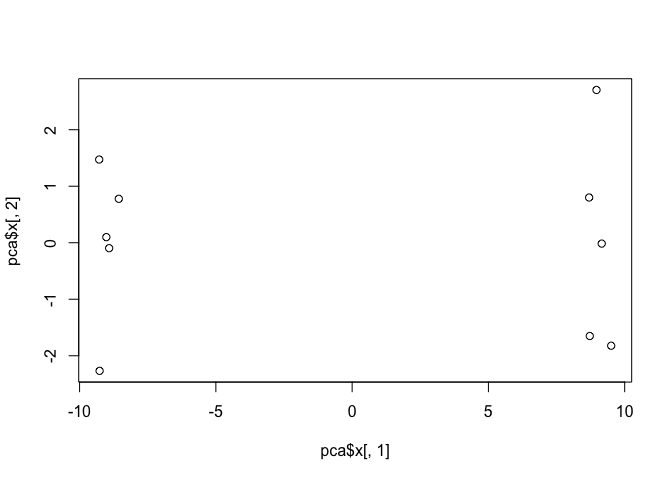

``` r
pca.var <- pca$sdev^2
pca.var.per <- round(pca.var/sum(pca.var)*100, 1)
barplot(pca.var.per, main="Scree Plot",
xlab="Principal Component", ylab="Percent Variation")
```

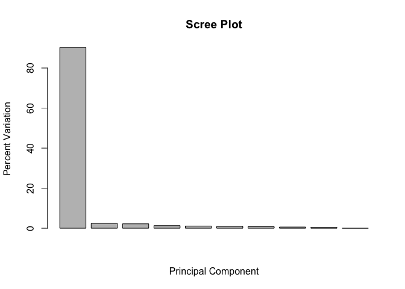

``` r
## A vector of colors for wt and ko samples
colvec <- colnames(mydata)
colvec[grep("wt", colvec)] <- "red"
colvec[grep("ko", colvec)] <- "blue"
plot(pca$x[,1], pca$x[,2], col=colvec, pch=16,
     xlab=paste0("PC1 (", pca.var.per[1], "%)"),
     ylab=paste0("PC2 (", pca.var.per[2], "%)"))
```

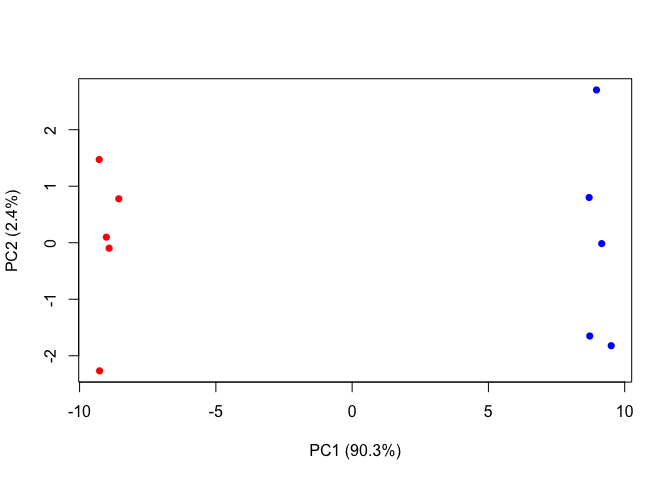

``` r
plot(pca$x[,1], pca$x[,2], col=colvec, pch=16,
     xlab=paste0("PC1 (", pca.var.per[1], "%)"),
     ylab=paste0("PC2 (", pca.var.per[2], "%)"))
```


food pca
========

``` r
x <- read.csv("UK_foods.csv")
dim(x)
```

    ## [1] 17  5

``` r
head(x)
```

    ##                X England Wales Scotland N.Ireland
    ## 1         Cheese     105   103      103        66
    ## 2  Carcass_meat      245   227      242       267
    ## 3    Other_meat      685   803      750       586
    ## 4           Fish     147   160      122        93
    ## 5 Fats_and_oils      193   235      184       209
    ## 6         Sugars     156   175      147       139

``` r
rownames(x) <- x[,1]
x <- x[,-1]
head(x)
```

    ##                England Wales Scotland N.Ireland
    ## Cheese             105   103      103        66
    ## Carcass_meat       245   227      242       267
    ## Other_meat         685   803      750       586
    ## Fish               147   160      122        93
    ## Fats_and_oils      193   235      184       209
    ## Sugars             156   175      147       139

``` r
dim(x)
```

    ## [1] 17  4

``` r
knitr::kable(x, caption="The full UK foods data table")
```

|                     |  England|  Wales|  Scotland|  N.Ireland|
|---------------------|--------:|------:|---------:|----------:|
| Cheese              |      105|    103|       103|         66|
| Carcass\_meat       |      245|    227|       242|        267|
| Other\_meat         |      685|    803|       750|        586|
| Fish                |      147|    160|       122|         93|
| Fats\_and\_oils     |      193|    235|       184|        209|
| Sugars              |      156|    175|       147|        139|
| Fresh\_potatoes     |      720|    874|       566|       1033|
| Fresh\_Veg          |      253|    265|       171|        143|
| Other\_Veg          |      488|    570|       418|        355|
| Processed\_potatoes |      198|    203|       220|        187|
| Processed\_Veg      |      360|    365|       337|        334|
| Fresh\_fruit        |     1102|   1137|       957|        674|
| Cereals             |     1472|   1582|      1462|       1494|
| Beverages           |       57|     73|        53|         47|
| Soft\_drinks        |     1374|   1256|      1572|       1506|
| Alcoholic\_drinks   |      375|    475|       458|        135|
| Confectionery       |       54|     64|        62|         41|

``` r
heatmap(as.matrix(x))
```

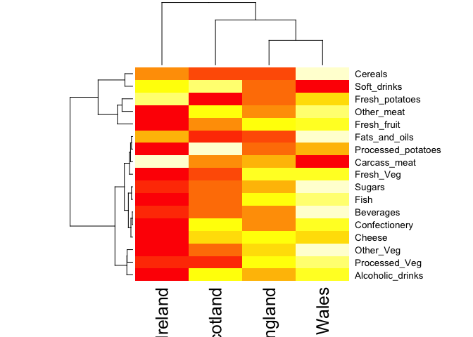

pca &lt;- prcomp( t(x)) summary(pca)
